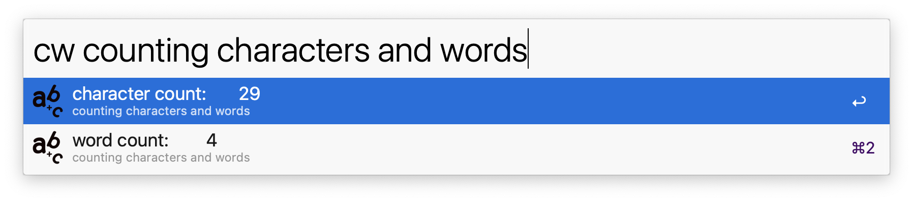

# Character & Word Counter for Alfred
An Alfred Workflow that counts characters &amp; words

From [this](https://github.com/ibnuh/alfred-character-counter-workflow/releases/tag/1.0) workflow, minus PHP

<a href="https://github.com/giovannicoppola/alfred-character-counter/releases/latest/">
 
</a>

## Installation
Download the latest [release](https://github.com/giovannicoppola/alfred-character-counter/releases/latest/)

## Usage
Keyword: `cw`

## Credits
1. Icons by [flaticon.com](https://www.flaticon.com/free-icon/alphabet-letters-a-b-and-c_27482)
2. [Original](https://github.com/ibnuh/alfred-character-counter-workflow/releases/tag/1.0)
